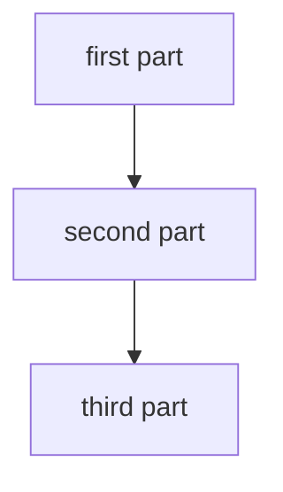

# Diagram reference

Applies to per-kind entries under `.claude/diagrams/`. Skip for `index.md`, which is regenerated by `aitk indexes regen`.

A diagram entry answers one question about the system with one or more Mermaid diagrams and the prose that makes them readable. It is not a rendering of the file tree. The check for any single line: does it tell a reader something the code layout would not have told them? If not, it belongs in `.claude/context/`.

## Scope

Governs per-kind diagram entries under `.claude/diagrams/`: which question each answers, the Mermaid source, the accessibility fields, and the explanation prose beneath. It states the voice for that prose, which is the yield `prose.md` grants a surface whose own standard sets one.

Does not govern:

- Language and word choice in explanation prose and node labels: `prose.md`, whose bans the yield does not lift
- Punctuation and formatting in explanation prose: `markdown.md`, which the yield does not reach
- The mechanism behind any component a diagram draws: `context.md`
- UI layout, on-screen copy, and interaction intent: `wireframes.md`
- The decision record a components diagram is drawn from: `architecture.md`

## What a working entry looks like

An entry works when a reader who has not opened the repository can answer its question:

- What are the parts, and which ones talk to each other?
- Which direction does the work flow, and where does it start?
- What would break if one box were removed?

An entry that fails these is non-conforming regardless of whether it satisfies every section rule below. The fences are the means. These three questions are the test.

## Frontmatter

- `title` (required): sentence case, names what the entry answers (`System context`, `Request flow`), not what it draws.
- `description` (required): one line on which question the entry settles and which source signal drives it.
- `category` (required): the diagram kind, one of the five in Entry kinds. It is the grouping field `aitk indexes regen` renders headings from.
- `verified` (required): the short commit SHA an entry was last checked against and the ISO date of that check, separated by a space (`73e9a3f8 2026-08-02`). A stub nobody has drawn yet carries the literal `TODO: never verified` instead, which is the one other accepted value.
- `stale` (optional): one line naming what changed under the entry since that check. Absent on an entry nothing has flagged.

The first three feed `.claude/diagrams/index.md` when regenerated. The catalog sorts categories alphabetically rather than in narrative order, so an entry cannot rely on its position to introduce another. Each entry names its own starting point, and the catalog's subtitle routes a first-time reader to the system context entry.

The marker fields reach the catalog through neither route. `aitk indexes regen` reads `title`, `description`, and `category` and ignores every other key, so a marker changes no generated file. A reader picks it up by opening the entry, which is where it sits above the diagram and where anyone deciding whether to trust the picture is already standing.

Two writers share the marker and neither touches the other's field. A pass that renders an entry and reads the picture back sets `verified` and clears `stale`. The `claude-docs` sweep appends `stale` and never edits `verified`. Keeping them separate is what lets a reader tell a diagram nobody has checked since the code moved from one that was checked and found correct.

## Entry kinds

Five kinds, each with a fixed filename and a fixed `category` value. Write a kind only when its source signal exists, and leave the rest absent rather than padding the folder.

- `system-context.md`, category `System context` (`flowchart TB`): who uses the system, what it talks to, and where its boundary sits. Drawn from `.claude/REQUIREMENTS.md`. This is the entry a reader outside the team opens first, and the only kind that draws the world outside the boundary.
- `components.md`, category `Components` (`flowchart TB` with `subgraph` boundaries): the layered structure inside the boundary. Drawn from `.claude/ARCHITECTURE.md`.
- `request-flow.md`, category `Request flow` (`sequenceDiagram`): a request lifecycle, an agent loop, or an interaction between actors.
- `data-pipeline.md`, category `Data pipeline` (`flowchart TB`): retrieval, ranking, queues, or ETL.
- `deployment.md`, category `Deployment` (`flowchart TB`): hosts, services, and infrastructure config.

The filenames are fixed rather than free, so a session refreshing one kind finds the file it is meant to overwrite instead of writing a second entry beside it under a name of its own.

Stay inside `flowchart` and `sequenceDiagram`. C4, state, ER, and class diagrams render inconsistently across viewers.

The kinds drift at rates spanning roughly an order of magnitude, which is why they are separate files. A deploy change rewrites one entry and leaves the other four untouched.

A second entry for one kind takes a suffixed name (`request-flow-admin.md`) and repeats the kind's `category` verbatim, which is what the grouping field is for. One entry per kind is the ordinary case, so most catalogs show one entry under each heading.

## Layout

- Declare `flowchart TB` by default. Mermaid ignores a subgraph's direction whenever that subgraph links outward, and an architecture diagram links across its subgraphs as the normal case, so top-bottom is a declaration rather than a guarantee.
- Restructure a diagram that renders diagonal or left-to-right. Repeating the direction keyword does not fix it.
- Render a context, component, or pipeline diagram taller than wide. A `sequenceDiagram` is wide by construction and is exempt.
- Do not let independent nodes render in a row. A row of siblings reads as a sequential chain and asserts a pipeline the system does not have.
- Do not converge many edges on one node from one side. A crossing bundle is unreadable whatever it encodes.
- Keep node labels short. Three or four words max. Detail goes in the paragraph below the diagram.
- Use `<br/>` for a second short line on a node when the label is two ideas, never for a sentence.
- Subgraphs are for grouping unrelated lanes such as offline versus online or browser versus server. Do not subgraph a single linear flow.

## Budgets

- Hold a diagram to roughly 5 to 10 nodes. Split it past 15.
- Watch edge count harder than node count. It binds first, and a diagram whose edges outnumber its nodes is already too dense to read.
- Treat a diagram that cannot be described in one sentence as two diagrams.
- Keep an entry to one diagram by default. A second fence in the same file needs its own H2 naming what it adds, and a third is a sign the entry covers two kinds.
- Warn rather than refuse on a budget, and name the split that would fix it. These numbers come from published Mermaid practice rather than from a measurement in this repository, so a hard refusal on them will be wrong sometimes and unarguable when it is.

## Accessibility

- Give every diagram `accTitle` and `accDescr`. `accTitle` names what the diagram answers. `accDescr` states the structure in one sentence for a reader who cannot see the render.

## Explanation

- One to three short paragraphs below each diagram. Plain English and pedagogical.
- Lead with what the diagram shows. Follow with why this shape was chosen and what alternative was rejected, when the choice was non-obvious.
- Reference one or two specific code paths the reader can open. Do not enumerate every file. Backticked paths here are also the set the `claude-docs` sweep watches, so a path cited in this section is one a later session gets told about when it leaves the tree.
- Do not duplicate prose across entries. An entry that restates its neighbor has taken the neighbor's job.
- The audience is mixed, so vocabulary runs as a gradient across the set. `System context` assumes no knowledge of the repository. `Deployment` may assume the reader has read the others.

This section states the voice for the surface, which is what claims the yield `prose.md` grants to a surface whose own standard sets it. Explanation prose is pedagogical here and the default developer-facing voice does not apply. The yield covers voice alone. The language bans in `prose.md` stay in force, as do the punctuation and formatting rules in `markdown.md`, which grants no yield at all.

## Verification

- Judge a diagram from its rendered image, not from its source. Direction, sibling rows, and edge bundles are visible only in the output.
- Render to PNG. An SVG export reads back as markup with no recoverable spatial meaning.
- Apply four tests as a reviewer, the same ones the author applied: direction held, no sibling row reading as a chain, no crossing edge bundle, taller than wide outside a sequence diagram.
- State which verification was skipped when no renderer is available. A diagram written without a render is still shippable, and one reported as verified without a render is not.

## What moves to .claude/context/

Implementation detail that answers how a component is built belongs in a `.claude/context/` entry, not a diagram:

- Function names, call signatures, and lifecycle ordering
- Library versions, config keys, and environment variable names
- Retry counts, timeouts, and batch sizes
- Workarounds and rejected approaches that need more than one sentence

Reference the context entry by path when a reader needs the mechanism. The diagram stays answerable on its own for structure and flow.

## Maintenance

- When the system changes, update the entries whose source signal changed and leave the rest alone. Rewriting the folder wholesale reproduces the defect the per-kind split exists to end.
- A diagram showing a defunct host or library is worse than no diagram. Audit the affected entry in the same PR.
- `System context` has no named source signal beyond `.claude/REQUIREMENTS.md`, so nothing tells a session it went stale. Re-read it when the boundary or the set of external dependencies moves.
- The `claude-docs` sweep watches two things and writes frontmatter only. It appends `stale` when a path an entry cites leaves the tree, and it stubs a kind when a diff adds the source signal that kind is drawn from. Diagram bodies and explanation paragraphs are off limits to it, because a change that removes a module does not carry the new correct shape of the picture.
- That watch samples thinly. It sees the one or two paths an entry happened to cite and nothing else, so a change elsewhere leaves the entry looking current. `verified` is what covers the gap, and an entry whose date sits far behind the branch is due a read whether or not anything flagged it.
- The explanation paragraphs around a Mermaid block are prose and follow `prose.md` and `markdown.md`. The fenced block itself is not, which is why a check scoped to prose is the wrong thing to rely on for what sits inside it.
- The punctuation bans still apply to node and subgraph labels, and nothing checks them there. An em dash in a label passes every gate the repository has, so read the labels before shipping the entry.

## Template

The filename and the `category` value both come from Entry kinds and are fixed per kind. A stub nobody has drawn yet carries `TODO: never verified` in place of the SHA and date. The node names and labels inside the fence are placeholders, written bare because Mermaid reads an angle bracket as markup.

````markdown
---
title: <what the entry answers>
description: <which question it settles and which source signal drives it>
category: <the kind, verbatim from Entry kinds>
verified: <short-sha> <YYYY-MM-DD>
---

# <what the entry answers>



<One paragraph leading with what the diagram shows.>

<One paragraph on why this shape was chosen and what was rejected, where the choice was non-obvious. Name one or two code paths the reader can open.>
````
