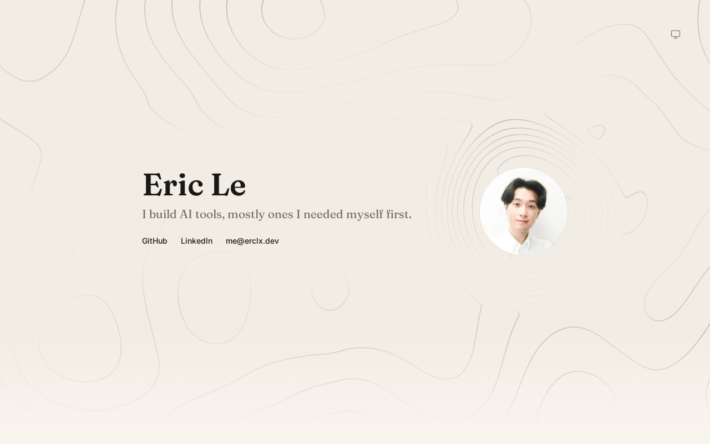

  <picture>
    <source media="(prefers-color-scheme: dark)" srcset="public/avatar/dark.png">
    
  </picture>

<h1 align="center">erclx.dev</h1>

<a href="https://erclx.dev"><b>erclx.dev</b></a>

<picture>
  <source media="(prefers-color-scheme: dark)" srcset=".github/evidence/readme/dark.png">
  
</picture>

## About

Most of the things I build start with some version of "this should be easier." I tend to get curious about how things work once something starts getting in my way, and that's usually how I end up building my own version.

I'm based in Gothenburg. Outside of building things, I play guitar, listen to a lot of music, play tennis, and travel when I can.

## Built with

Astro, Tailwind, and shadcn/ui, deployed to Cloudflare Pages.
