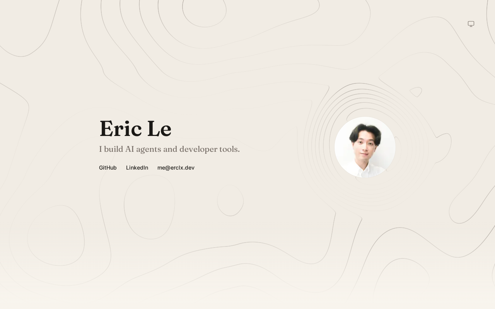

  <picture>
    <source media="(prefers-color-scheme: dark)" srcset="public/avatar/dark.png">
    
  </picture>

<h1 align="center">erclx.dev</h1>

<a href="https://erclx.dev"><b>erclx.dev</b></a>

<picture>
  <source media="(prefers-color-scheme: dark)" srcset=".github/evidence/readme/dark.png">
  
</picture>

## About

I'm Eric, an AI engineer in Gothenburg. I studied physics at Chalmers, got hooked on AI agents during my master's thesis at Volvo, and now spend my days building AI tools and agents, mostly ones I needed myself first.

Outside of work I do calisthenics, play tennis, and travel whenever I can.

## Built with

Astro, Tailwind, and shadcn/ui, deployed to Cloudflare Pages.
